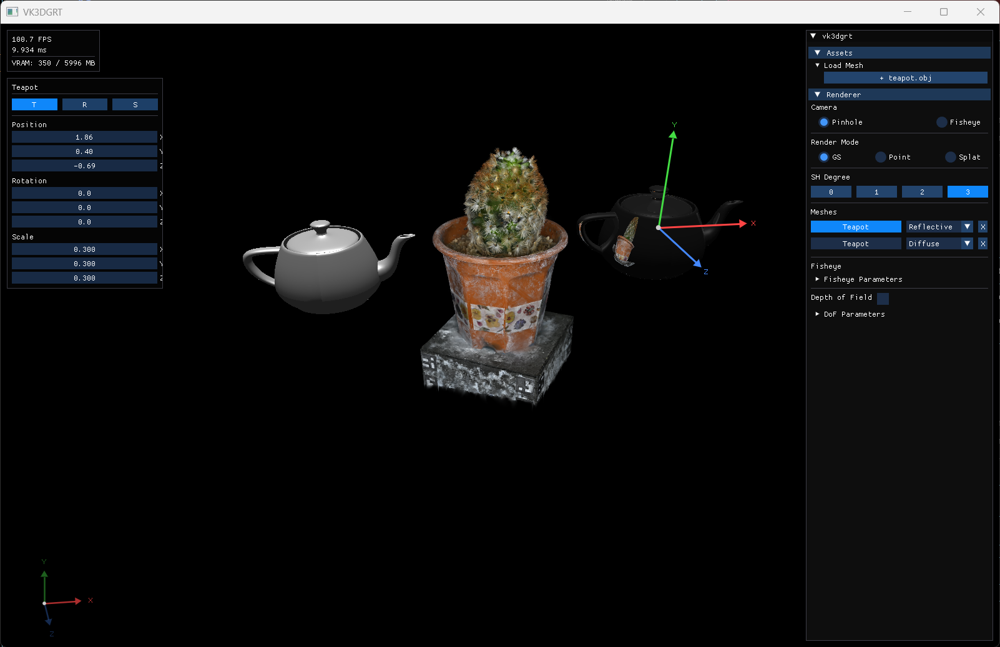
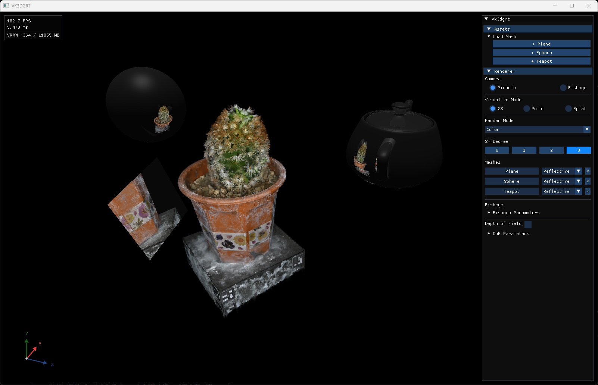
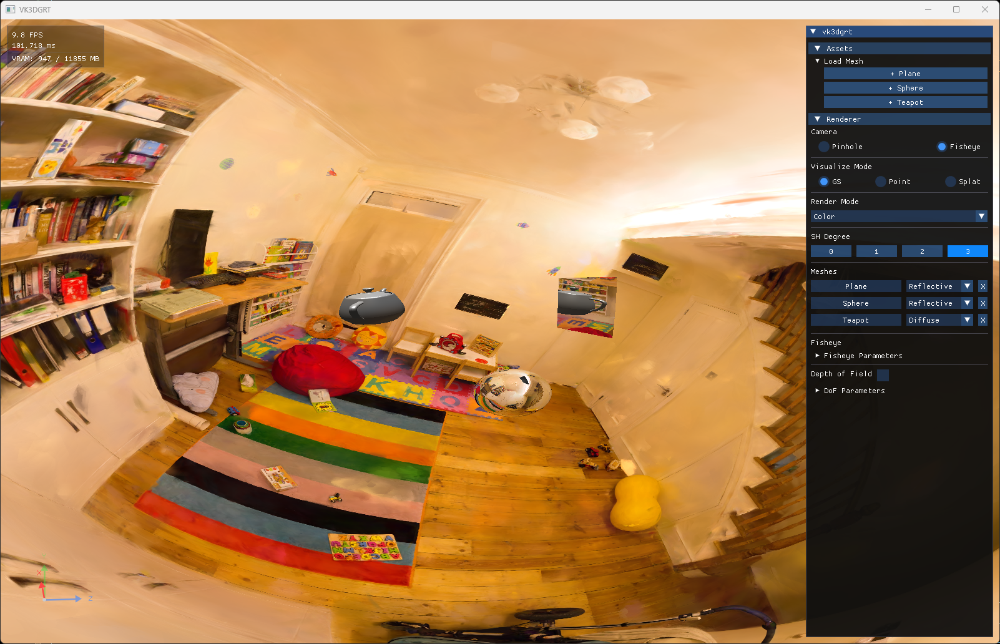
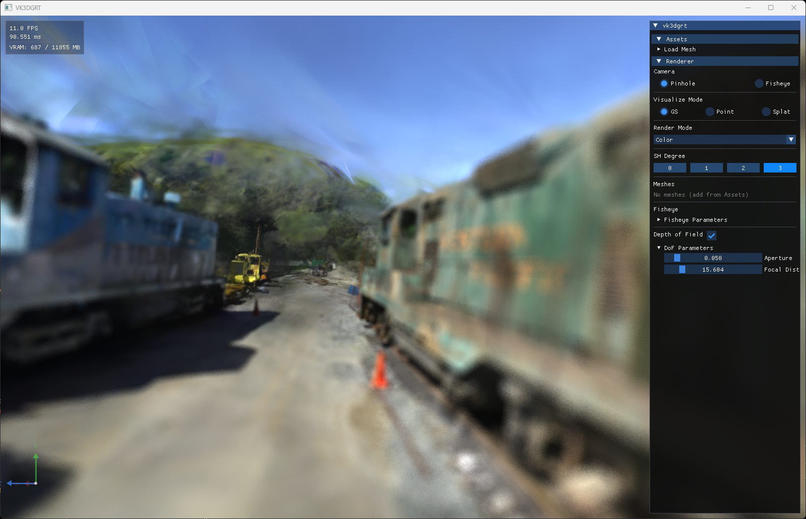
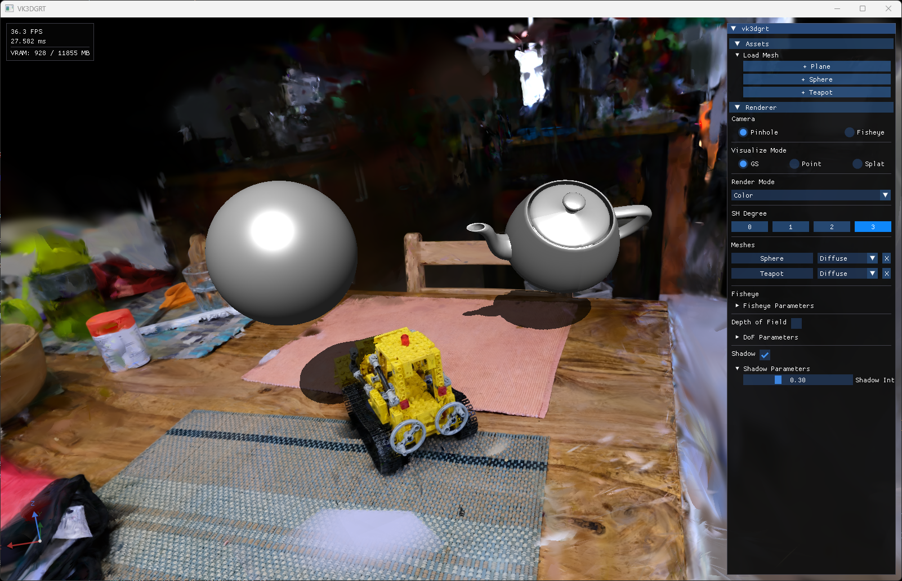
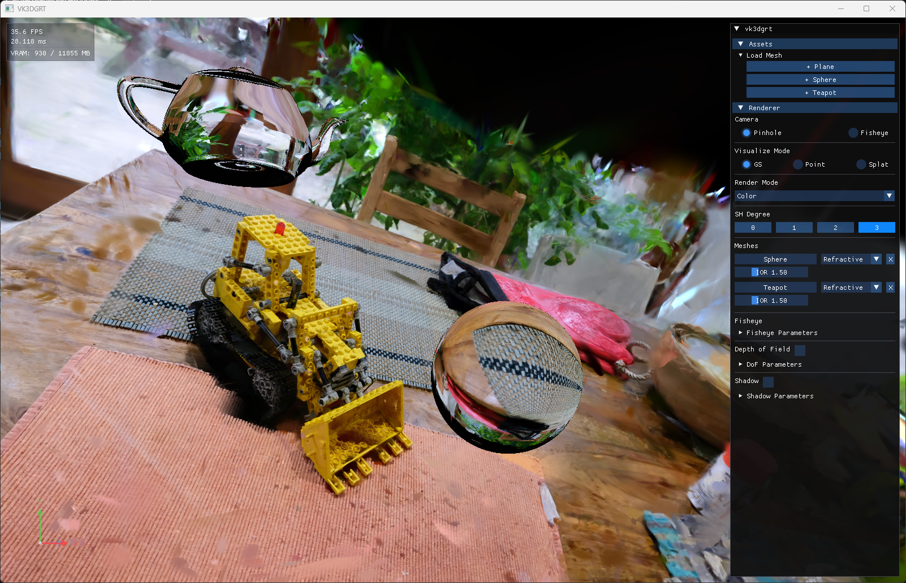
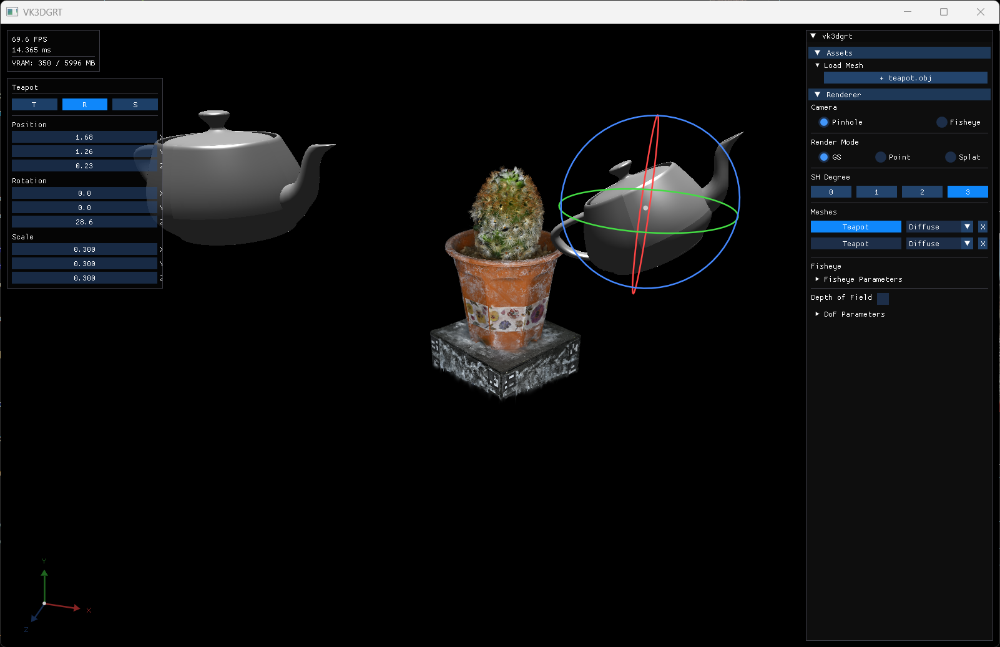

# Vulkan-based 3D Gaussian Ray Tracing (3DGRT) Viewer



_Scene Downloaded from: [LINK](https://huggingface.co/datasets/Voxel51/gaussian_splatting)_

## 📒 TL;DR

A Vulkan-based implementation of the 3DGRT (3D Gaussian Ray Tracing) paper (SIGGRAPH Asia 2024), built as a personal project to learn the Vulkan API and GPU ray tracing pipeline.
Unlike traditional rasterization-based 3D Gaussian Splatting, 3DGRT traces rays against a BVH of Gaussian particles, enabling secondary lighting effects and complex camera models. The current implementation supports reflection, depth of field, and fisheye camera rendering.

## ⚙️ Requirements

| Item | Requirement |
|------|-------------|
| GPU | Vulkan Ray Tracing capable GPU (e.g. NVIDIA RTX series) |
| Vulkan SDK | [LunarG Vulkan SDK](https://vulkan.lunarg.com/) |
| Compiler | MSVC (Visual Studio 2022) |
| CMake | 3.16+ |
| C++ Standard | C++23 |

## 📦 Dependencies

Managed via Git submodules.

| Library | Purpose |
|---------|---------|
| [GLFW](https://github.com/glfw/glfw) | Window and input handling |
| [ImGui](https://github.com/ocornut/imgui) | GUI |
| [GLM](https://github.com/g-truc/glm) | Math library |
| [VMA](https://github.com/GPUOpen-LibrariesAndSDKs/VulkanMemoryAllocator) | Vulkan memory management |
| [tinyply](https://github.com/ddiakopoulos/tinyply) | PLY file parsing |
| [tinyobjloader](https://github.com/tinyobjloader/tinyobjloader) | OBJ file loader |

## 🖥️ Tested Environment

| Item | Spec |
|------|------|
| OS | Windows 11 Home |
| GPU | NVIDIA GeForce RTX 5070 |
| Driver | 32.0.15.7688 |
| Vulkan SDK | 1.4.328.1 |
| MSVC | 19.38.33135 (VS 2022) |
| CMake | 3.30.5 |

## 🔨 Build

```bash
# 1. Clone
git clone --recursive https://github.com/jgnooo/vk3dgrt.git
cd vk3dgrt

# If submodules were not cloned
git submodule update --init --recursive

# 2. Build (requires VS 2022 Developer Environment)
cmake -B build -S . -G Ninja
cmake --build build --config Release
```

## 🚀 Run

```bash
# Specify a PLY file
./build/bin/vk3dgrt.exe path/to/scene.ply
```

## 🎬 Features

<div align="center">
<table>
  <tr>
    <td align="center">
      <strong>Reflection</strong><br>
      
    </td>
    <td align="center">
      <strong>Fisheye</strong><br>
      
    </td>
  </tr>
  <tr>
    <td align="center">
      <strong>DoF</strong><br>
      
    </td>
    <td align="center">
      <strong>Simple Shadow</strong><br>
      
    </td>
  </tr>
  <tr>
    <td align="center">
      <strong>Refraction</strong><br>
      
    </td>
    <td align="center">
      <strong>Mesh Gizmo</strong><br>
      
    </td>
  </tr>
</table>
</div>

## 🗂️ Project Structure

```
vk3dgrt/
├── src/
│   ├── main.cpp              # Entry point
│   ├── vulkan/               # Vulkan engine (context, pipeline, buffer, image, etc.)
│   ├── 3dgrt/                # 3DGRT implementation (scene, loader, renderer, accel struct)
│   └── gui/                  # ImGui integration and camera control
├── shaders/                  # GLSL shaders (rgen, rchit, rahit, rmiss, utils/)
├── data/                     # PLY scene, teapot.obj
└── dependencies/             # External libraries (git submodules)
```

## 📥 Assets

Place the following file in `data/` directory before running:

```powershell
# Download teapot.obj (used by nvpro-samples/vk_gaussian_splatting)
Invoke-WebRequest -Uri "https://raw.githubusercontent.com/alecjacobson/common-3d-test-models/master/data/teapot.obj" -OutFile "data/teapot.obj"
```

## 📚 References

- [3D Gaussian Ray Tracing: Fast Tracing of Particle Scenes](https://arxiv.org/abs/2407.07090) (SIGGRAPH Asia 2024)

## 🙏 Acknowledgments

- Official implementation: [nv-tlabs/3dgrut](https://github.com/nv-tlabs/3dgrut)
- Vulkan-based official implementation: [nvpro-samples/vk_gaussian_splatting](https://github.com/nvpro-samples/vk_gaussian_splatting)
- [Claude](https://claude.ai) (Anthropic) assisted with code refactoring and rendering optimization.

## 📋 Todo

- [ ] **Keyboard Events**
- [ ] **Test on Ubuntu**